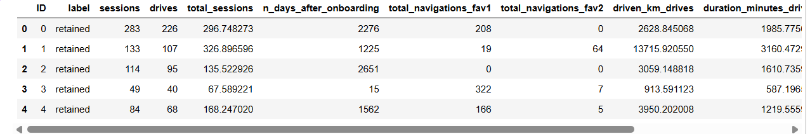
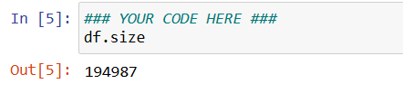
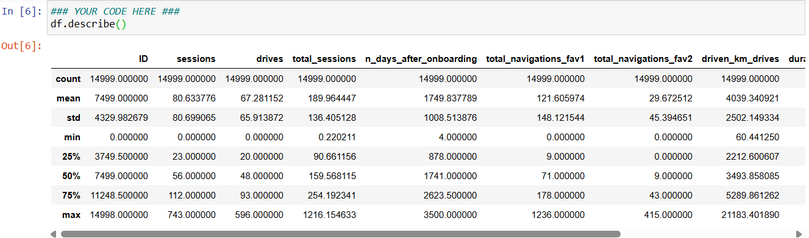
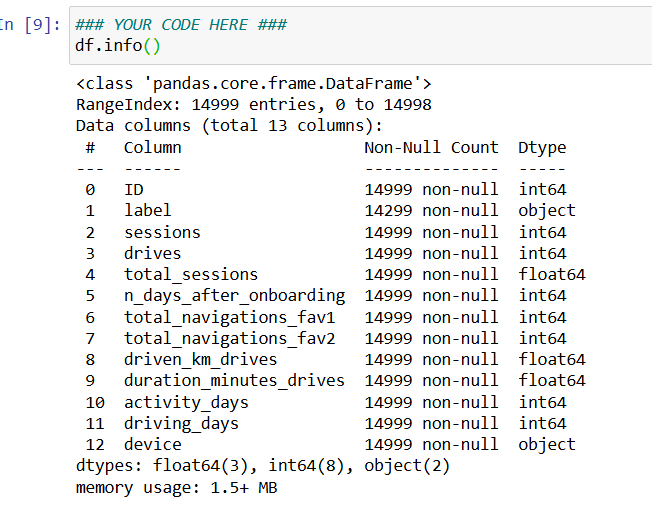

# Proyecto Waze Curso 2 - Ve más allá de los números: Traduce datos en información valiosa (Insights)

Tu equipo aún se encuentra en las primeras etapas del proyecto sobre la pérdida de usuarios (user churn). Hasta ahora, has completado una propuesta de proyecto y has utilizado Python para inspeccionar y organizar los datos de los usuarios de Waze.

Revisas tu bandeja de entrada y notas un nuevo mensaje de Chidi Ga, el Analista de Datos Senior de tu equipo. Chidi está complacido con el trabajo que ya has completado y solicita tu ayuda con el análisis exploratorio de datos (EDA) y una mayor visualización de datos. Harriet Hadzic, Directora de Análisis de Datos de Waze, querrá revisar un cuaderno (notebook) de Python que muestre tu exploración y visualización de datos.  

Se estructuró y preparó un cuaderno para ayudarte en este proyecto. Por favor, completa las siguientes preguntas y prepara un resumen ejecutivo.

Proyecto de fin de curso del Curso 2: Análisis exploratorio de datos (EDA)
En esta actividad, examinarás los datos proporcionados y los prepararás para el análisis.

El propósito de este proyecto es realizar un análisis exploratorio de datos (EDA) en un conjunto de datos (dataset) suministrado.

El objetivo es continuar con el examen de los datos que comenzaste en el curso anterior, agregando visualizaciones relevantes que ayuden a comunicar la historia que cuentan los datos.

Esta actividad consta de 4 partes:

Parte 1: Importaciones, enlaces y carga de datos

Parte 2: Exploración de datos y Limpieza de datos

Parte 3: Construcción de visualizaciones

Parte 4: Evaluación y comunicación de resultados

Sigue las instrucciones y responde a la pregunta de abajo para completar la actividad. Luego, completarás un resumen ejecutivo utilizando las preguntas enumeradas en el Documento de Estrategia PACE.  

Asegúrate de completar esta actividad antes de continuar. El próximo elemento del curso te proporcionará un modelo/ejemplar completado para que lo compares con tu propio trabajo.

## Tarea 1.
### Importaciones y carga de datos Para el análisis exploratorio de datos (EDA), importa los datos y los paquetes que serán de mayor utilidad, tales como pandas, numpy y matplotlib.###

    import numpy as ap
    import pandas as pd
    import matplotlib.pyplot as plt
    import seaborn as sns

### Analizar Considera las preguntas de tu Documento de Estrategia PACE y las que se presentan a continuación, según corresponda, para completar tu código:

### ¿Es necesario reestructurar los datos o convertirlos a formatos utilizables?

Respuesta: No es necesario hacer una reestructuracion completa como derretir datos o tablas pero si es recomendable realizar pequeñas conversiones logicas si se va a trabajar con variables categoricas complejas como label o device

### ¿Existe alguna variable que tenga datos faltantes?

Respuesta:Si al revisar el dataset de waze podremos notar datos faltantes en algunas varibles que nos indicara si algun usuario de waze abandono la aplicaicon o tiene valores nulos.

# Tarea 2. Exploración y limpieza de datos

## Considera las siguientes preguntas:

### Dado el escenario, ¿cuáles columnas de datos son las más aplicables?
Respuesta: Las columnas más aplicables son aquellas que describen el comportamiento, laactividad y el perfil del usuario en relación con el abandono de la aplicación. Esto incluye lavariable objetivo label (que indica si el usuario se quedó o se fue), y variables predictorasclave como sessions (sesiones), drives (viajes realizados), total_sessions, driven_km_drives(kilómetros conducidos), duration_minutes_drives (minutos conducidos) y device (tipo dedispositivo).

### ¿Cuáles columnas de datos puedes eliminar, sabiendo que no resolverán el escenario de tu problema?
Respuesta: La columna ID se puede eliminar (o no tomar en cuenta en los modelos) debido a que es un identificador único numérico para cada fila que no aporta ningún patrón de comportamiento ni valor estadístico para predecir la pérdida de usuarios.

### ¿Cómo verificarías si hay datos faltantes? Y ¿cómo manejarías los datos faltantes (si los hay)?
Respuesta: Para verificar datos faltantes en Python se utiliza el comando df.isna().sum() o dfisnull().sum(). Para manejarlos, dado que los datos faltantes se encuentran específicamente enla columna categórica label, se puede optar por excluir temporalmente esas filas en losanálisis estadísticos directos o visualizaciones de la tasa de abandono para no sesgar losporcentajes reales, o evaluar si el volumen de nulos es lo suficientemente bajo como paraeliminarlos sin perder representatividad.

### ¿Cómo verificarías si hay valores atípicos (outliers)? Y ¿cómo manejarías los valores atípicos (si los hay)?
Respuesta: Para verificar valores atípicos se utiliza el método numérico df.describe()(observando diferencias drásticas entre el percentil 75 y el valor máximo) y herramientasvisuales como diagramas de caja (boxplot) o histogramas. Para manejarlos, dependiendo delimpacto, se pueden aplicar técnicas como el aislamiento (recortar/reemplazar los valoresextremos fijándolos en un percentil alto como el 95 o 99 mediante imputación por límites) osimplemente conservarlos si representan comportamientos reales de usuarios extremadamenteactivos de la aplicación.

# PACE: Construir
## Considera las siguientes preguntas mientras te preparas para lidiar con los valores atípicos (outliers):

### ¿Cuáles son algunas formas de identificar los valores atípicos?
Respuesta:
1. Método del Rango Intercuartílico (IQR): Es uno de los más utilizados en análisis exploratorio. Se calcula la diferencia entre el tercer cuartil (Q3) y el primer cuartil (Q1) para obtener el IQR. Cualquier dato que se encuentre por debajo de $Q1 - 1.5 \times IQR$ o por encima de $Q3 + 1.5 \times IQR$ se considera un valor atípico.

2. Puntuación Z (Z-Score): Mide a cuántas desviaciones estándar se encuentra un punto de datos respecto a la media. En distribuciones que se aproximan a una campana normal, los valores con un Z-score mayor a 3 o menor a -3 suelen identificarse como atípicos.

3.Visualizaciones Gráficas: * Diagramas de caja (Boxplots): Reflejan directamente el método IQR mostrando los valores extremos como puntos aislados fuera de los "bigotes".

4.Visualizaciones Gráficas: * Diagramas de caja (Boxplots): Reflejan directamente el método IQR mostrando los valores extremos como puntos aislados fuera de los "bigotes".

### ¿Cómo tomas la decisión de conservar o excluir los valores atípicos de cualquier modelo futuro?
Respuesta: La decisión no depende de una regla matemática fija, sino de la naturaleza de los datos y del objetivo del negocio. Se deben considerar los siguientes escenarios:

Excluir o modificarlos si:
    1.Son errores: Si se deben a fallos del sistema o registros imposibles (ej. velocidades irreales o distancias negativas), deben eliminarse o corregirse.
    2.Afectan al modelo: Algoritmos como la regresión lineal son muy sensibles a los extremos. En estos casos se pueden borrar o truncar usando técnicas como el winsorizing (reemplazarlos por los percentiles 95 o 99).
        Conservalor si:
            1.Son datos reales e importantes: Si reflejan un comportamiento legítimo del negocio (ej. conductores que viajan distancias muy largas por trabajo), eliminarlos sesgaría la realidad.
            2.El modelo es robusto: Si vas a usar algoritmos basados en árboles de decisión (como Random Forest o XGBoost), no es necesario quitarlos, ya que estos modelos son inmunes a su impacto.

# Tarea 3a. Visualizaciones
Selecciona los tipos de visualización de datos que te ayudarán a comprender y explicar los datos.

Ahora que ya sabes qué columnas de datos vas a utilizar, es momento de decidir qué visualización de datos tiene más sentido para el EDA (Análisis Exploratorio de Datos) del conjunto de datos de Waze.

Pregunta: ¿Qué tipo de visualización(es) de datos será(n) la(s) más útil(es)?
    Respuesta: 
    Gráfico de líneas (Line graph)
    Gráfico de barras (Bar chart)
    Gráfico de caja (Box plot)
    Histograma (Histogram)
    Mapa de calor (Heat map)
    Gráfico de dispersión (Scatter plot)
    Mapa geográfico (A geographic map)

## Sesions

Gráfico de caja (Boxplot) para analizar la distribución de sesiones mensuales por usuario.
Configura el lienzo alargado (10x2) con su título, y usa 'fliersize=1' para mantener
limpios los puntos atípicos de los usuarios que entran a la app de forma masiva.

    plt.figure(figsize=(10,2))
    plt.title('Boxplot of monthly sessions')sns.boxplot(data=None, x=data['sessions'], fliersize=1)

Histograma para analizar la frecuencia de las sesiones mensuales.
Configura el lienzo alargado (10x2) con título para observar cómo se distribuyen
los conteos de apertura de la app entre toda la base de datos de usuarios.

    plt.figure(figsize=(5,3))
    plt.title('histogram of ocurrence of a user opening the app during the month')
    sns.histplot(df['sessions'])
    median = df['sessions'].median()
    plt.axvline(median, color='red', linestyle='--')
    plt.text(75,1200, 'median=56.0', color='red')

## Drives

"Un evento/ocurrencia de conducir al menos 1 km durante el mes"

Gráfico de caja (Boxplot) para analizar la distribución de viajes mensuales ('drives').
Configura el lienzo alargado (10x2) y usa 'fliersize=1' para observar con claridad
los valores atípicos de los usuarios que registran una cantidad masiva de viajes.

    plt.figure(figsize=(10,2))
    plt.title('Boxplot of monthly drives')
    sns.boxplot(data=None, x=data['drives'], fliersize=1)

Histograma para analizar la frecuencia de los viajes realizados en el mes.
Configura el lienzo (10x2) con su título para evaluar visualmente la forma de la
distribución y los rangos de viajes más comunes entre los usuarios.
Crear una funccion que sirva como base para todos los histogramas

    def histogrammer(column_str, median_text=true, **kwargs):
        median=round(df[column_str].median(), 1)
        plt.figure(figsize=(5,3))
        ax = sns.histoplot(x=df[column_str], **kwargs)
        plt.axvline(median, color='red', linestyle='--')
        if median_text==true:
            ax.text(0.25, 0.85, f'median={median}, color='red',
                ha='left', va='top', transform=ax.transAxes)
        else:
            print('Median:', median)
        plt:title(f'{column_str} histogram')

Ejecutar:

    histrogrammer('drives')

## Total Sessions

Una estimación del modelo sobre el número total de sesiones desde que un usuario se registró (hizo el onboarding).

La variable total_sessions tiene una distribución sesgada a la derecha (right-skewed). La mediana del número total de sesiones es 159.6. Esta es información interesante porque, si la mediana del número de sesiones en el último mes fue de 48 y la mediana del total histórico de sesiones fue de aproximadamente 160, entonces parece que una gran proporción de los viajes totales de un usuario podría haber tenido lugar en el último mes. Esto es algo que podrás examinar más de cerca más adelante.

Gráfico de caja (Boxplot) para analizar el total histórico de sesiones ('total_sessions').
Configura un lienzo alargado (10x2) para visualizar cómo los datos se estiran hacia la derecha
debido a los usuarios antiguos o con un uso masivo de la app.

    plt.figure(figsize=(10,2))
    plt.title('Boxplot of total sessions')
    sns.boxplot(data=None, x=data['total_sessions'], fliersize=1)

Histograma para analizar la distribución total de sesiones acumuladas.
Configura el lienzo (10x2) para comprobar visualmente el sesgo a la derecha (right-skew)
que caracteriza a esta variable histórica.

    histogrammer('total_sessions')

## n_days_after_onbording

n_days_after_onboarding El número de días desde que un usuario se registró en la aplicación.

La antigüedad total del usuario (es decir, el número de días desde el onboarding) es una distribución uniforme con valores que van desde casi cero hasta aproximadamente 3,500 días (unos 9.5 años).

Gráfico de caja (Boxplot) para analizar la antigüedad de los usuarios.
Al ser una distribución uniforme (como vimos en el histograma), la caja queda 
perfectamente centrada en el gráfico y no se generan puntos atípicos (outliers) a los lados.

    plt.figure(figsize=(8,1))
    plt.title('Boxplot Number of days since a user signed')
    sns.boxplot(data=None, x=df['n_days_after_onboarding'], fliersize=1)

Llama a la función auxiliadora para graficar el histograma de la antigüedad de los usuarios.
Generará la distribución uniforme (plana) y pintará automáticamente la línea de la mediana.

    histogrammer('n_days_after_onboarding')

## driven_km_drives

total de kilometros recorridos durante un mes
El número de kilómetros recorridos por usuario el mes pasado presenta una distribución asimétrica positiva, con la mitad de los usuarios recorriendo menos de 3495 kilómetros. Como se pudo comprobar en el análisis del curso anterior, los usuarios de este conjunto de datos recorren distancias muy largas. La mayor distancia recorrida durante el mes superó la mitad de la circunferencia de la Tierra.

Gráfico de caja (Boxplot) para analizar el total de kilómetros conducidos en el mes.
Nota el pequeño error de dedo en el título original ('Botplox' -> 'Boxplot').
Configura el lienzo alargado (8x1) y usa 'fliersize=1' para manejar la visualización
de los valores atípicos que generan los conductores de largas distancias.

    plt.figure(figsize=(8,1))
    plt.title('Boxplot driven_km_drives')
    sns.boxplot(data=None, x=df['driven_km_drives'], fliersize=1)

Llama a la función auxiliadora para graficar el histograma de los kilómetros conducidos.
Esto revelará qué tan sesgada a la derecha está la distribución de las distancias mensuales.

    histogrammer('driven_km_drives')

## duration_minutes_drives

total de duracion manejando en minutos durante el mes
ves tiene una cola derecha muy sesgada. La mitad de los usuarios condujeron menos de ~1478 minutos (~25 horas), pero algunos usuarios registraron más de 250 horas durante el mes.

Gráfico de caja (Boxplot) para analizar la duración total de los viajes en minutos.
Configura el lienzo alargado (8x1) y mantiene 'fliersize=1' para observar la dispersión
y los valores atípicos de los usuarios que acumulan muchísimos minutos al volante.

    plt.figure(figsize=(8,1))
    plt.title('Duration minutes drives Boxplot')
    sns.boxplot(data=None, x=df['duration_minutes_drives'], fliersize=1)

Llama a la función auxiliadora para graficar el histograma de la duración total en minutos.
Permite evaluar visualmente el sesgo a la derecha en el tiempo mensual de conducción.

    histogrammer('duration_minutes_drives')

## Activity_days

Durante el último mes, los usuarios abrieron la aplicación una mediana de 16 veces. El diagrama de caja revela una distribución centrada. El histograma muestra una distribución casi uniforme de aproximadamente 500 personas que abrieron la aplicación cada cierto número de días. Sin embargo, hay aproximadamente 250 personas que no abrieron la aplicación en absoluto y otras 250 que la abrieron todos los días del mes.

Gráfico de caja (Boxplot) para analizar los días de actividad en el mes ('activity_days').
Configura el lienzo alargado (8x1) y usa 'fliersize=1' para evaluar cómo se distribuyen
los días en que los usuarios abrieron la aplicación (independientemente de si condujeron o no).

    plt.figure(figsize=(8,1))
    plt.title('Activity days boxplot')
    sns.boxplot(data=None, x=df['activity_days'], fliersize=1)

Llama a la función auxiliadora para graficar el histograma de los días de actividad.
Esto nos mostrará la frecuencia con la que los usuarios abren la app en un mes.

    histogrammer('activity_days')

## Driving_days

numero de dias que el usuario condujeron 1km durante el mes

El número de días que los usuarios condujeron cada mes es casi uniforme y se correlaciona en gran medida con el número de días que abrieron la aplicación ese mes, excepto que la distribución de `driving_days` disminuye hacia la derecha.

Sin embargo, hubo casi el doble de usuarios (~1000 frente a ~550) que no condujeron en absoluto durante el mes. Esto puede parecer contradictorio si se considera junto con la información de `activity_days`. Esta variable registró ~500 usuarios que abrieron la aplicación casi todos los días, pero solo hubo ~250 usuarios que no la abrieron en absoluto durante el mes y ~250 usuarios que la abrieron todos los días. Se debe registrar este hallazgo para una investigación posterior.

Gráfico de caja (Boxplot) para analizar los días de conducción en el mes ('driving_days').
Configura el lienzo (8x1) y usa 'fliersize=1' para observar la dispersión de los datos.

    plt.figure(figsize=(8,1))
    plt.title('driving_days box plot')
    sns.boxplot(data=None, x=df['driving_days'], fliersize=1)

Llama a la función auxiliadora para graficar el histograma de los días de conducción.
Esto revelará la frecuencia mensual de uso del automóvil por parte de los usuarios.
histogrammer('driving_days')

## Device
El tipo de dispositivo con el que un usuario inicia una sesión.

Esta es una variable categórica, por lo que no se representa con un diagrama de caja. Un buen gráfico para una variable categórica binaria es un gráfico circular.

Gráfico de pastel (Pie chart) para analizar la distribución de usuarios según su dispositivo.
Corrige el pequeño error de dedo en el título original ('divice' -> 'device').
Se utiliza .value_counts() para obtener los totales de cada tipo de dispositivo (iPhone vs. Android)
y se configuran etiquetas dinámicas que muestran el nombre del dispositivo junto a su cantidad exacta.

    plt.figure(figsize=(3,3))
    data = df['device'].value_counts()
    plt.pie(data,
            labels=[f'{data.index[0]}: {data.values[0]}',
                    f'{data.index[1]}: {data.values[1]}'],
            autopct='%1.1f%%'
            )
    plt.title('Users by device')

En estos datos, hay casi el doble de usuarios de iPhone que de usuarios de Android.

## label

Variable binaria («usuario retenido» frente a «usuario dado de baja») para indicar si un usuario se ha dado de baja en algún momento del mes.

Esta también es una variable categórica, por lo que no se representará en un diagrama de cajas. En su lugar, se representará un gráfico circular.

Gráfico de pastel (Pie chart) para analizar la proporción de usuarios retenidos vs. la tasa de abandono (churn).
Utiliza .value_counts() para contar cuántos usuarios pertenecen a cada categoría ('retained' vs. 'churned').
Muestra etiquetas dinámicas con el total exacto por grupo (.values) y calcula el porcentaje con un decimal.

    fig = plt.figure(figsize=(3,3))
    data = df['label'].value_counts()
    plt.pie(data,
            labels=[f'{data.index[0]}: {data.values[0]}',
                    f'{data.index[1]}: {data.values[1]}'],
            autopct='%1.1f%%'
            )
    plt.title('Count of retained vs. churned')

## Días de conducción vs. Días de actividad
Dado que tanto los días de conducción como los días de actividad representan el número de días al mes y están estrechamente relacionados, se pueden graficar juntos en un solo histograma. Esto ayudará a comprender mejor su relación sin tener que comparar histogramas en dos lugares diferentes.

Grafica un histograma que, para cada día, tenga una barra que represente el número de días de conducción y días de actividad.

Histograma comparativo de días de conducción frente a días de actividad.
Al pasar ambas columnas como una lista a plt.hist(), Matplotlib creará barras
agrupadas lado a lado para cada contenedor (bin) del 0 al 32. Esto permite una
comparación directa y visual de cómo se cruzan ambos comportamientos en el mes.

    plt.figure(figsize=(12,4))
    label = ['Días conducidos', 'Días de actividad']

    plt.hist([df['driving_days'], df['activity_days']],
            bins=range(0, 33),
            label=label)

    plt.xlabel('Days')
    plt.ylabel('Count')
    plt.legend()
    plt.title('Días conducidos vs. Días de actividad');

Como se mencionó anteriormente, esto podría parecer contraintuitivo. Después de todo, ¿por qué hay menos personas que no usaron la aplicación en absoluto durante el mes y más personas que no condujeron en absoluto durante el mes?

Por otro lado, podría ser simplemente un ejemplo de que, si bien estas variables están relacionadas, no son lo mismo. Probablemente, las personas abren la aplicación con más frecuencia de la que la usan para conducir; tal vez para consultar los tiempos de viaje o la información de la ruta, para actualizar la configuración o incluso por error.

No obstante, podría ser útil contactar al equipo de datos de Waze para obtener más información al respecto, especialmente porque parece que el número de días del mes no es el mismo para ambas variables.

Confirme el número máximo de días para cada variable: `driving_days` y `activity_days`.

Imrpimir el numero maximo de dias para cada variable

    print(df['driving_days'].max())
    print(df['activity_days'].max())

    Respuesta = 30
                31

Es cierto. Si bien es posible que ningún usuario haya conducido los 31 días del mes, es muy improbable, considerando que el conjunto de datos incluye a 15 000 personas.

Otra forma de comprobar la validez de estas variables es crear un diagrama de dispersión simple, donde el eje x represente una variable y el eje y la otra.

Gráfico de dispersión (Scatter plot) para analizar la relación entre días de conducción y días de actividad.
Incluye una línea de referencia diagonal (y = x) en color rojo y trazo punteado.
Permite identificar visualmente si existen usuarios que registran más días de conducción que de actividad,
lo cual indicaría una anomalía o un error potencial en la captura de los datos.

    plt.figure(figsize=(8, 6))
    sns.scatterplot(data=df, x='driving_days', y='activity_days')
    plt.title('Días conduciendo vs. Días activos')
Pintar la línea de identidad diagonal desde el punto (0,0) hasta el (31,31)

    plt.plot([0,31], [0,31], color='red', linestyle='--')

Tenga en cuenta que existe un límite teórico. Si usa la aplicación para conducir, por definición también se contabiliza como un día de uso. En otras palabras, no puede tener más días de conducción que días de actividad. Ninguna de las muestras de estos datos infringe esta regla, lo cual es positivo.

## Retención por dispositivo
Grafica un histograma que tenga cuatro barras —una para cada combinación de dispositivo y etiqueta (device-label)— para mostrar cuántos usuarios de iPhone fueron retenid

Histograma agrupado (usando histplot) para analizar la retención y el abandono según el dispositivo.
El argumento 'multiple="dodge"' separa las barras de 'retained' y 'churned' lado a lado en lugar de apilarlas.
El parámetro 'shrink=0.9' añade un pequeño espacio entre los bloques de barras, mejorando la estética del gráfico.

    plt.figure(figsize=(5,4))
    sns.histplot(data=df,
                x='device',
                hue='label',
                multiple='dodge',
                shrink=0.9
                )
    plt.title('Retention by device histogram');

La proporción de usuarios que abandonaron la aplicación frente a los usuarios retenidos es constante entre los diferentes tipos de dispositivos.

## Retención por kilómetros conducidos por día de conducción
En el curso anterior, descubriste que la mediana de la distancia conducida por día de conducción el mes pasado para los usuarios que abandonaron la aplicación (churned) fue de 697.54 km, frente a 289.55 km para las personas que no la abandonaron. Examina esto más a fondo.

### 1. Crea una nueva columna en df llamada km_per_driving_day, la cual represente la distancia promedio conducida por día de conducción para cada usuario.

Crear la nueva columna 'km_per_driving_day'
Representa la distancia promedio conducida por cada día de manejo en el mes.
Se obtiene dividiendo los kilómetros totales ('driven_km_drives') entre los días de conducción

    ('driving_days').
    df['km_per_driving_day'] = df['driven_km_drives'] / df['driving_days']

### 2. Llama al método describe() en la nueva columna.
Obtener el resumen estadístico descriptivo de la nueva columna
Ejecuta .describe() para analizar métricas clave como la media, la mediana (50%),
los valores mínimos/máximos y evaluar la dispersión de este nuevo promedio.

    df['km_per_driving_day'].describe()

¿Qué notas? El valor de la media es infinito, la desviación estándar es NaN y el valor máximo es infinito. ¿Por qué crees que ocurre esto?

Esto es el resultado de que existen valores de cero en la columna driving_days. Pandas asigna un valor de infinito en las filas correspondientes de la nueva columna porque la división por cero no está definida.

### 1. Convierte estos valores de infinito a cero. Puedes usar np.inf para hacer referencia a un valor de infinito.

Reemplazar los valores infinitos (provocados por la división por cero) por 0.
Utiliza df.loc para localizar las filas donde 'km_per_driving_day' sea igual a np.inf
y asigna el valor de 0 en esa misma columna para limpiar los datos.

    df.loc[df['km_per_driving_day'] == np.inf, 'km_per_driving_day'] = 0

### 2. Llama a describe() en la columna km_per_driving_day para verificar que funcionó

Confirmar que el reemplazo funcionó correctamente.
Al ejecutar nuevamente .describe(), la media y la desviación estándar ya no serán infinitas o NaN,
y el valor máximo reflejará la distancia real más alta por día conducido.

    df['km_per_driving_day'].describe()

El valor máximo es de 15,420 kilómetros por día de conducción. Esto es físicamente imposible. Conducir a 100 km/h durante 12 horas equivale a 1,200 km. Es poco probable que muchas personas hayan promediado más que esto cada día que condujeron; por lo tanto, por ahora, descarta las filas donde la distancia en esta columna sea mayor a 1,200 km.

Grafica un histograma de la nueva columna km_per_driving_day, descartando a aquellos usuarios con valores mayores a 1,200 km. Cada barra debe tener la misma longitud y contar con dos colores: un color que represente el porcentaje de usuarios en esa barra que abandonaron la aplicación (churned) y el otro que represente el porcentaje de los que fueron retenidos (retained). Esto se puede lograr configurando el parámetro multiple de la función histplot() de seaborn en fill.

Configurar el tamaño del lienzo para que sea lo suficientemente ancho (12x5)

    plt.figure(figsize=(12,5))

Graficar el histograma de porcentaje apilado al 100%

    sns.histplot(data=df,
                x='km_per_driving_day',         # Variable cuantitativa en el eje X
                bins=range(0, 1201, 20),         # Contenedores de 20 km en 20 km, limitando el máximo a 1200 km
                hue='label',                     # Separar visualmente por estado del usuario (retained vs. churned)
                multiple='fill')                 # Parámetro clave: escala las barras al 100% para mostrar proporciones

Ajustar la etiqueta del eje Y para que muestre el símbolo de porcentaje de forma horizontal

    plt.ylabel('%', rotation=0)

Asignar el título descriptivo al gráfico

    plt.title('Tasa de abandono según el promedio de kilómetros recorridos por día');

La tasa de abandono (churn rate) tiende a aumentar a medida que incrementa la distancia promedio diaria conducida, lo que confirma lo descubierto en el curso anterior. Valdría la pena investigar más a fondo las razones por las cuales los usuarios de largas distancias dejan de utilizar la aplicación.

### Tasa de abandono por número de días conducidos
Crea otro histograma exactamente igual al anterior, solo que esta vez debe representar la tasa de abandono (churn rate) para cada número de días conducidos

Configurar el tamaño del lienzo (12x5) para observar con claridad la tendencia mensual

    plt.figure(figsize=(12,5))

Graficar el histograma de porcentaje apilado para evaluar la fidelidad según los días de uso

    sns.histplot(data=df,
                x='driving_days',         # Variable cuantitativa discreta en el eje X (días del mes)
                bins=range(1, 32),        # Contenedores para agrupar los datos del día 1 al 31
                hue='label',              # Segmentar por estado del usuario (retained vs. churned)
                multiple='fill',          # Escalar todas las barras al 100% para mostrar la tasa de abandono
                discrete=True)            # Parámetro clave: alinea las barras exactamente sobre cada número entero (día)

Ajustar la etiqueta del eje Y para representar el porcentaje de forma horizontal

    plt.ylabel('%', rotation=0)

Asignar el título descriptivo al gráfico

    plt.title('Abandonos por número de días conducidos');

La tasa de abandono (churn rate) es más alta entre las personas que no usaron mucho Waze durante el último mes. Cuantas más veces utilizaron la aplicación, menos probabilidades tenían de abandonarla. Mientras que el 40% de los usuarios que no usaron la aplicación en absoluto el mes pasado la abandonaron, ninguna de las personas que usó la aplicación los 30 días se marchó.

Esto no es sorprendente. Si las personas que usan mucho la aplicación la abandonaran, probablemente indicaría insatisfacción. Cuando las personas que no usan la aplicación se van, podría ser el resultado de una insatisfacción en el pasado, o podría indicar una menor necesidad de una aplicación de navegación. Tal vez se mudaron a una ciudad con buen transporte público y ya no necesitan conducir

### Proporción de sesiones que ocurrieron en el último mes
Crea una nueva columna llamada percent_sessions_in_last_month que represente el porcentaje del total de sesiones de cada usuario que fueron registradas en su último mes de uso.

Crear la nueva columna 'percent_sessions_in_last_month'
Calcula la proporción de sesiones que el usuario realizó en el último mes respecto a su histórico total.
Se obtiene dividiendo las sesiones mensuales ('sessions') entre las sesiones totales acumuladas ('total_sessions').
Nota: El resultado estará expresado en formato decimal (por ejemplo, 0.5 representa el 50%).

    df['percent_sessions_in_last_month'] = df['sessions'] / df['total_sessions']

¿Cuál es el valor de la mediana de la nueva columna?

Calcular la mediana de la columna 'percent_sessions_in_last_month'
Este método devuelve el valor numérico que divide los datos exactamente por la mitad (percentil 50%).
Sirve para entender el comportamiento del usuario típico, siendo más robusto que la media frente a valores atípicos.

    df['percent_sessions_in_last_month'].median()

Ahora, crearas un histograma explicando la distribucion de los valores de la nueva columna

1. Configurar el tamaño del lienzo para una vista compacta y alargada (8x2).
2. Asignar el título descriptivo al gráfico de distribución.
3. Graficar el histograma de la proporción de sesiones del último mes.
4. Calcular de forma independiente la mediana de los datos (percentil 50%).
5. Dibujar una línea vertical en la posición de la mediana para marcar el centro.
6. Configurar la línea de color rojo y estilo discontinuo ('--') para que resalte.

        plt.figure(figsize=(8,2))
        plt.title('Histogram of percent sessions in last month')
        sns.histplot(df['percent_sessions_in_last_month'])
        media = df['percent_sessions_in_last_month'].median()
        plt.axvline(media, color='red', linestyle='--');

mira el valor medio de la variable n_days_after_onboarding

variable media de la columna 'n_days_after_onboarding'

    df['n_days_after_onboarding'].median()

La mitad de las personas en el conjunto de datos tuvieron el 40% o más de sus sesiones solo en el último mes; sin embargo, la mediana general del tiempo transcurrido desde la incorporación (onboarding) es de casi cinco años.

Haz un histograma de n_days_after_onboarding solo para las personas que tuvieron el 40% o más de sus sesiones totales en el último mes."

1. Filtrar el dataframe para conservar solo los usuarios con un 40% o más de sesiones en el último mes.
2. Configurar el tamaño del lienzo en proporciones compactas (5x2).
3. Asignar el título descriptivo para identificar el histograma de días desde el registro.
4. Graficar la distribución de la columna 'n_days_after_onboarding' para el segmento filtrado.

        data = df.loc[df['percent_sessions_in_last_month'] >= 0.4]
        plt.figure(figsize=(5,2))
        plt.title('Histogram n_days_after_onboarding')
        sns.histplot(x=data['n_days_after_onboarding']);

El número de días transcurridos desde la incorporación (onboarding) para los usuarios con el 40% o más de sus sesiones totales ocurridas solo en el último mes presenta una distribución uniforme. Esto es muy extraño. Valdría la pena preguntar a Waze por qué tantos usuarios antiguos de repente usaron tanto la aplicación en el último mes."

# Tarea 3b. Manejo de valores atípicos (outliers)
Los gráficos de caja (box plots) de la sección anterior indicaron que muchas de estas variables tienen valores atípicos. Estos valores atípicos no parecen ser errores de ingreso de datos; están presentes debido a las distribuciones sesgadas a la derecha.

Dependiendo de lo que vayas a hacer con estos datos, puede ser útil imputar los datos atípicos con valores más razonables. Una forma de realizar esta imputación es establecer un umbral basado en un percentil de la distribución.  

Para practicar esta técnica, escribe una función que calcule el percentil 95 de una columna determinada y luego impute los valores mayores a dicho percentil con el valor que se encuentra en el percentil 95.

1. Definir una función para imputar valores atípicos (outliers) utilizando un percentil como umbral.
2. Calcular el valor de corte (threshold) correspondiente al percentil indicado usando el método .quantile().
3. Localizar las filas donde el valor supera el umbral y reemplazarlas con ese mismo valor límite.
4. Imprimir un reporte en consola alineado a la derecha con el nombre de la columna, el percentil y su umbral.

        def outlier_imputer(column_name, percentile):
            # Calcular el valor del percentil especificado (ej. 0.95 para el percentil 95)
            threshold = df[column_name].quantile(percentile)
            # Reemplazar cualquier valor que supere el umbral con el valor del umbral
            df.loc[df[column_name] > threshold, column_name] = threshold
            # Mostrar el resultado en pantalla con un formato limpio y alineado (| columna | percentil | umbral)
            print('{:>25} | percentile: {} | threshold: {}'.format(column_name, percentile, threshold))

1. Iterar a través de la lista de columnas numéricas que presentaron valores atípicos severos.
2. Aplicar la función 'outlier_imputer' en cada iteración para limitar los datos al percentil 95 (0.95).
3. La función modificará el DataFrame 'df' en sitio e imprimirá un reporte de los umbrales aplicados.

        for column in ['sessions', 'drives', 'total_sessions',
                    'driven_km_drives', 'duration_minutes_drives']:
            outlier_imputer(column, 0.95)

# Conclusión
El análisis reveló que la tasa de abandono (churn rate) general es de aproximadamente el 17%, y que esta tasa es consistente tanto entre usuarios de iPhone como de Android.

Tal vez sientas que cuanto más profundamente exploras los datos, surgen más preguntas. ¡Esto no es inusual! En este caso, valdría la pena preguntar al equipo de datos de Waze por qué tantos usuarios utilizaron tanto la aplicación solo en el último mes.

Además, el Análisis Exploratorio de Datos (EDA) ha revelado que los usuarios que conducen distancias muy largas en sus días de conducción tienen más probabilidades de abandonar la app, pero los usuarios que conducen con más frecuencia tienen menos probabilidades de abandonarla. La razón de esta discrepancia representa una oportunidad para una investigación más detallada, y sería otro aspecto sobre el cual consultar al equipo de datos de Waze.

